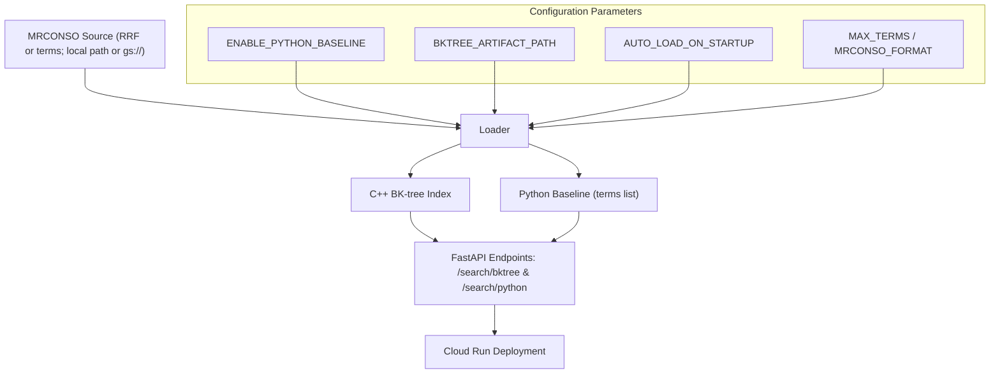

# BK-tree vs Python Fuzzy Search (MRCONSO)

[](https://github.com/AndrewMichael2020/search-MRCONSO-service/actions/workflows/tests.yml)
[](https://github.com/AndrewMichael2020/search-MRCONSO-service/actions/workflows/deploy.yml)
[](LICENSE)
[](https://www.python.org/downloads/)
[](https://fastapi.tiangolo.com/)
[](./cppmatch.cpp)
[](./Dockerfile)
[](https://cloud.google.com/run)
[](https://github.com/AndrewMichael2020/search-MRCONSO-service/commits)
[](https://github.com/AndrewMichael2020/search-MRCONSO-service/issues)

A performance comparison demo between a compiled **C++ BK-tree** (via pybind11) and **pure-Python Levenshtein** search across MRCONSO-like medical terminology. Includes a FastAPI service deployable to Google Cloud Run.

---

## 📖 In Plain Language: Why This Matters

### The Problem We're Solving

Medical terminology databases like **MRCONSO** (from UMLS) contain millions of terms—drug names, disease names, procedure codes, and their variations. 

UMLS stands for Unified Medical Language System. It’s a large collection of biomedical vocabularies and standards maintained by the U.S. National Library of Medicine (NLM). It provides a framework for integrating and mapping between medical terminologies such as SNOMED CT / SNOMED CA, ICD-10/ICD-10-CA, LOINC, RxNorm, and others. Together, UMLS enables consistent meaning and interoperability across diverse healthcare data systems.

The MRCONSO table (short for Metathesaurus Concept Names and Sources) within UMLS stores:

- Concept unique identifiers (CUI),

- Source vocabulary identifiers (SAB),

- Language codes, and

- Preferred terms, synonyms, and lexical variants (STR).

When a user searches for "carditis" (inflammation of the heart), we want to find not just exact matches, but also **near-matches** like:

- "Cardiitis" (common misspelling, 1 character different)
- "Carditis NOS" (variant with qualifier)
- Similar terms the user might have meant

This is called **fuzzy matching** or **approximate string matching**. It's essential because:
- Users make typos,
- Medical terms have many variations and synonyms, or 
- Exact matching misses 80%+ of relevant results.

### How We Measure "Closeness": Levenshtein Distance

We use **Levenshtein distance** to measure how different two words are. It counts the minimum number of single-character edits (insert, delete, substitute) needed to change one word into another:

- "carditis" → "Carditis" = **0 edits** (case-insensitive match)
- "carditis" → "cardiitis" = **1 edit** (insert one 'i')
- "carditis" → "arthritis" = **4 edits** (too different)

When a user searches for "carditis" with a tolerance of 1 edit, we return all terms within distance 1.

### Two Approaches, Different Speeds

#### **Python Baseline (Simple but Slow)**
- **What it does:** Compares the search term to *every single term* in the database, one by one
- **Analogy:** Like checking every book in a library by hand
- **Speed:** For 50,000 terms, this takes ~140ms per search
- **Problem:** Doesn't scale—doubling the database size doubles the search time

#### **BK-tree (Smart Data Structure, Much Faster)**
- **What it does:** Organizes terms into a tree structure that lets us skip large chunks of irrelevant terms
- **Analogy:** Like using a library's card catalog to jump directly to the right shelf
- **Speed:** For 50,000 terms, this takes ~2ms per search (69× faster!)
- **C++ Implementation:** We use C++ because it's a compiled language that runs much faster than interpreted Python for this kind of heavy computation

There are other search implementations (e.g., tries, VP-trees), but BK-trees are just one example that is a great fit for Levenshtein distance and fuzzy matching.

### Why We Built This Test

**Question:** Is it worth the extra complexity of using C++ instead of pure Python?

**Answer:** Yes—but we wanted **proof with real numbers**, not just theory:

1. **Speed Under Load:** Our tests show the C++ BK-tree handles **220 searches per second** on Cloud Run, while Python tops out at **37 searches/second** (5.9× slower)
2. **Scalability:** C++ performance improves with more concurrent users; Python hits a hard ceiling
3. **Latency Consistency:** C++ maintains ~80-220ms response times even at high load; Python latency balloons to 1.3+ seconds

### Bottom Line in Plain Language

If you're building a tool that:
- Searches large medical terminology databases
- Needs to handle multiple users at once
- Requires sub-second response times

...then investing in a BK-tree with C++ acceleration pays off. This repository provides:
- ✅ Working code you can deploy immediately (Docker + Cloud Run)
- ✅ Reproducible benchmarks showing real-world performance
- ✅ Side-by-side API endpoints so you can test both approaches yourself

**No C++ knowledge required to use it**—just deploy to Cloud Run and call the REST API from your analytics tools (R, Python, Tableau, etc.).

---

## 🎯 What This Does

- **Parses** MRCONSO-like pipe-delimited term files
- **Indexes** terms using a BK-tree for efficient fuzzy matching
- **Compares** search performance: C++ BK-tree vs Python baseline
- **Exposes** REST API endpoints for interactive searches
- **Benchmarks** both approaches with reproducible metrics
- **Deploys** to GCP Cloud Run with full CI/CD

## 🚀 Quick Start

### Local Development

```bash
# Install system dependencies (Ubuntu/Debian)
sudo apt update && sudo apt install -y build-essential python3-dev

# Install Python dependencies
pip install -r requirements.txt

# Build C++ extension
python setup.py build_ext --inplace

# Generate synthetic sample data
python scripts/make_sample_from_mrconso.py --out data/mrconso_sample.txt --n 50000

# Run benchmark
python benchmark.py

# Start API server
uvicorn app:app --reload
```

### Using Docker

```bash
# Generate sample data first
python scripts/make_sample_from_mrconso.py --out data/mrconso_sample.txt --n 50000

# Build and run
docker build -t bktree-bench .
docker run -p 8080:8080 bktree-bench
```

## 📚 API Endpoints

- `GET /healthz` and `GET /healthz/` - Health check (Cloud Run prefers the trailing slash)
- `POST /search/bktree` - Search using BK-tree (fast)
- `GET /search/bktree` - Convenience GET variant: `?q=term&max_dist=1&k=10`
- `POST /search/python` - Search using Python (baseline)
- `GET /search/python` - Convenience GET variant: `?q=term` (may return 503 in prod if baseline disabled)
- `POST /benchmarks/run` - Run performance benchmark (in-process; dev/staging only)

### Example Request

```bash
curl -X POST http://localhost:8080/search/bktree \
  -H "Content-Type: application/json" \
  -d '{"query": "carditis", "maxdist": 1}'
```

Or via GET:

```bash
curl "http://localhost:8080/search/bktree?q=carditis&max_dist=1&k=5"
```

### Example Response

```json
{
  "matches": [
    {"term": "Carditis", "distance": 0},
    {"term": "Cardiitis", "distance": 1}
  ]
}
```

## 📊 Benchmark Results

Real-world performance comparison between C++ BK-tree and Python baseline on 50,000 MRCONSO terms. **TL;DR: C++ is 5–6× faster on Cloud Run and 70× faster locally.**

### Cloud Run Performance (50k terms, maxdist=1)

#### C++ BK-tree (`/search/bktree`)

| Concurrency | Queries | RPS | Avg Latency | p95 Latency | p99 Latency | Success |
|-------------|---------|-----|-------------|-------------|-------------|---------|
| 10 | 2,000 | **121.7** | 81.7 ms | 85.7 ms | 89.0 ms | 100% |
| 25 | 2,000 | **199.0** | 123.5 ms | 171.9 ms | 197.6 ms | 100% |
| **50** | **2,000** | **220.2** | **219.6 ms** | **277.1 ms** | **302.2 ms** | **100%** |
| 25 | 5,000 | **191.3** | 129.0 ms | 168.4 ms | 269.6 ms | 100% |

**Key findings:**
- ✅ **Scales beautifully** with concurrency (10→25→50)
- ✅ **Peak throughput**: 220 requests/sec at c=50
- ✅ **Consistent performance** across different query loads
- ✅ **Low latency** even under heavy load (avg < 220ms at c=50)

#### Python baseline (`/search/python`)

| Concurrency | Queries | RPS | Avg Latency | p95 Latency | p99 Latency | Success |
|-------------|---------|-----|-------------|-------------|-------------|---------|
| 25 | 2,000 | **36.7** | 676.8 ms | 722.7 ms | 862.1 ms | 100% |
| **50** | **2,000** | **37.2** | **1328.7 ms** | **1383.3 ms** | **1404.1 ms** | **100%** |

**Key findings:**
- ⚠️ **Does NOT scale** with concurrency (RPS plateaus at ~37)
- ⚠️ **Latency doubles** under load (677ms → 1329ms at c=50)
- ⚠️ **Single-threaded bottleneck** (sequential scan through all terms)

#### Head-to-Head Comparison

**At concurrency 25:**
- C++ is **5.4× faster** in throughput (199 RPS vs 37 RPS)
- C++ has **5.5× lower latency** (124ms vs 677ms avg)

**At concurrency 50:**
- C++ is **5.9× faster** in throughput (220 RPS vs 37 RPS)
- C++ has **6.1× lower latency** (220ms vs 1329ms avg)

**The performance gap widens under load!** The C++ BK-tree scales gracefully with concurrency, while the Python baseline hits a hard ceiling and latency degrades badly.

### Local (Codespaces, in-process engine)

- Dataset: ~50,000 terms, 1,000 queries, maxdist=1
  - BK-tree: 0.284 s total (≈3519 QPS)
  - Python baseline: 19.777 s total (≈50.6 QPS)
  - **Speedup: 69.6×** (Python/BK-tree)

The local speedup is even more dramatic because there's no HTTP overhead—just raw algorithm performance.

Run `python benchmark.py` for a quick check, or use the harness below for larger, reproducible runs.

### Massive-ish Benchmarks

For larger, reportable runs, use the harness in `scripts/massive_benchmark.py`.

- Remote (deployed service, async HTTP load):

  ```bash
  # 2k queries, concurrency 25, maxdist=1
  python scripts/massive_benchmark.py remote \
    --base-url https://YOUR-SERVICE-URL \
    --endpoint bktree \
    --queries 2000 --concurrency 25 --maxdist 1 \
    --out-json docs/reports/remote_2k_c25.json
  ```

- Local (in-process C++ BKTree vs Python baseline):

  ```bash
  # 50k+ terms, 1k queries
  PYTHONPATH=. python scripts/massive_benchmark.py local \
    --terms data/umls/2025AA/MRCONSO.RRF \
    --limit-terms 50000 \
    --queries 1000 --maxdist 1 \
    --out-json docs/reports/local_mrconso_50k.json
  ```

The harness prints a JSON summary (RPS and latency percentiles for remote; build time, QPS, and Python/BK speedup for local) and writes it to the path you provide.

## 🧪 Testing

```bash
# Generate test data
python scripts/make_sample_from_mrconso.py --out data/mrconso_sample.txt --n 1000

# Run tests
pytest -v
```

## 🏗️ Architecture

See [docs/INSTRUCTIONS.md](docs/INSTRUCTIONS.md) for complete architecture details.



## 🌐 Try it on Cloud Run

Warm the service and verify readiness, then run a quick search. Replace the URL if you deploy your own.

```bash
# Base URL
BASE="https://search-mrconso-service-160858128371.northamerica-northeast1.run.app"

# 1) Kick off loading (if not auto-loading)
curl -sS -X POST "$BASE/load" | jq .

# 2) Wait until loaded=true (note the trailing slash on /healthz/)
until curl -sS "$BASE/healthz/" | jq -e '.loaded == true' >/dev/null; do
  echo "waiting for load..."; sleep 2; done
curl -sS "$BASE/healthz/" | jq .

# 3) Try a search (BK-tree)
curl -sS "$BASE/search/bktree?q=carditis&max_dist=1&k=5" | jq .

# Optional: the Python baseline is disabled in prod, so /search/python may return 503
```

## 📂 Project Structure

```
.
├── app.py                      # FastAPI application
├── benchmark.py                # Quick CLI benchmark
├── cppmatch.cpp                # C++ BK-tree implementation
├── setup.py                    # Build configuration
├── test_basic.py               # Unit tests
├── test_app_loading.py         # Load/health tests
├── requirements.txt            # Python dependencies
├── Dockerfile                  # Container image
├── examples/
│   ├── app_example.py          # API usage example
│   └── benchmark_example.py    # Benchmark usage example
├── scripts/
│   ├── make_sample_from_mrconso.py  # Sample data generator
│   ├── precompute_terms_job.py      # Batch precompute helper
│   └── massive_benchmark.py         # Remote+local load testing harness
├── data/
│   ├── mrconso_sample.txt      # Sample terms (generated)
│   └── umls/2025AA/MRCONSO.RRF # Full MRCONSO (example path)
└── docs/
  ├── INSTRUCTIONS.md         # Complete product spec
  ├── README.md               # Docs entry point
  ├── instructions/           # Architecture, deployment, quickstart
  └── reports/                # Saved benchmark JSONs
```

## ⚙️ Configuration

- `MRCONSO_PATH` – source MRCONSO (.RRF or cache) file; local path or `gs://bucket/object`.
- `BKTREE_ARTIFACT_PATH` – optional tar.gz with `bktree.bin` + `metadata.json`. If set, the service loads the prebuilt index (faster startup). The Python baseline is not available when using an artifact.
- `ENABLE_PYTHON_BASELINE` – enable baseline list search (dev/staging). Disable in prod.
- `AUTO_LOAD_ON_STARTUP` – `true` to kick off background loading when the process boots.
- `MRCONSO_FORMAT` – `rrf` for raw MRCONSO rows, `terms` for one-term-per-line caches.
- `MAX_TERMS` – optional cap to sample a subset (useful for smoke tests/local dev).
- `BK_TMP_DIR` – optional tmpfs/RAM-backed path for large artifact extraction on Cloud Run.
- `CANONICAL_BASE_URL` – optional host canonicalization (308 redirects) for public deployments.
- `LOG_LEVEL` – `INFO` (default), `DEBUG`, etc.
- `SHUTDOWN_AFTER_SECONDS` – optional TTL (e.g. `1200`) to exit the container after load completes.

Cloud Run tip: use `/healthz/` (with trailing slash) in health checks and probes to avoid upstream 404s.

## 🔐 Security & Privacy

- **No PHI or protected health information**
- Uses synthetic or public sample data only
- Cloud Run deployment uses OIDC (no long-lived keys)
- See [INSTRUCTIONS.md](docs/INSTRUCTIONS.md) for full security details

## 📝 License

MIT License - see [LICENSE](LICENSE) file for details.

## 🤝 Contributing

This is a demonstration project. For production use with real UMLS data, ensure you have appropriate licensing from NLM.

## 📖 Further Reading

- [docs/INSTRUCTIONS.md](docs/INSTRUCTIONS.md) - Complete product specifications
- [CHANGELOG.md](CHANGELOG.md) - Version history
